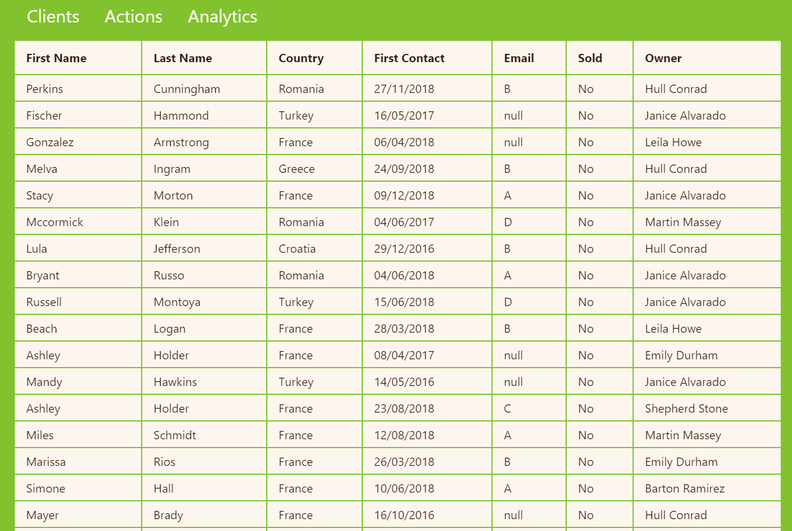
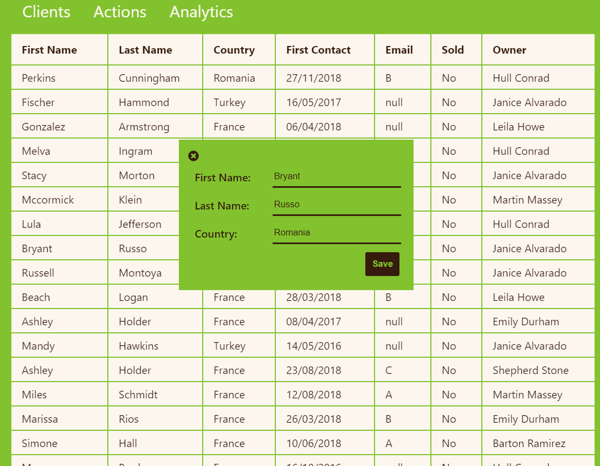
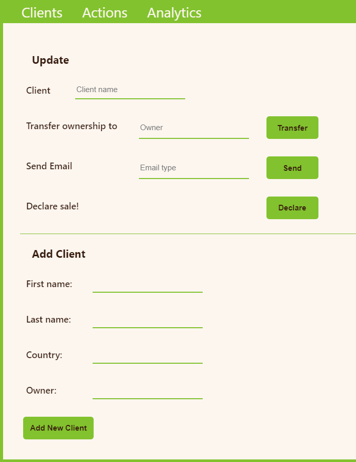
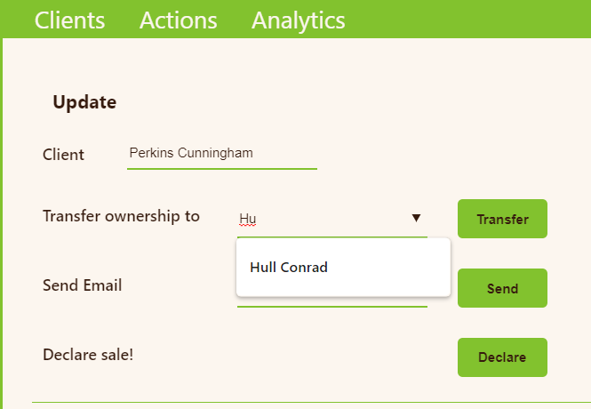
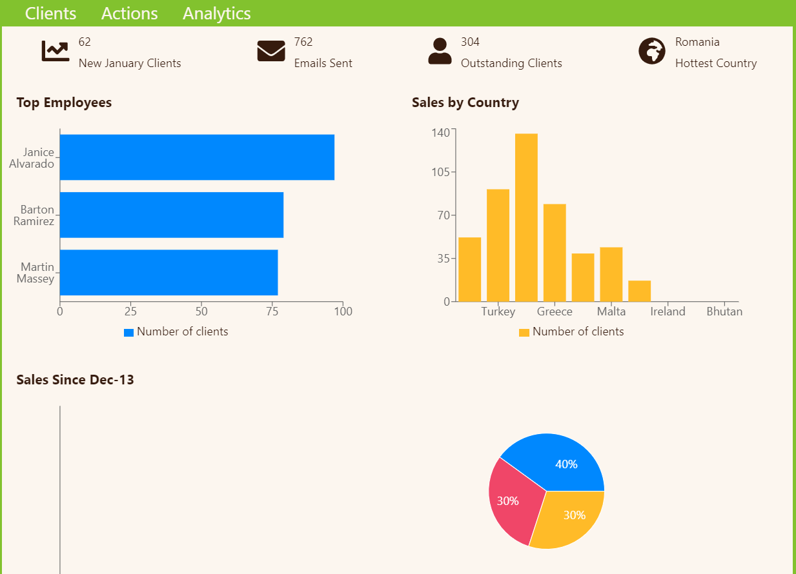

# CRM

## Screenshots

### Home Screen

Home screen has a table of client information.

Update client info directly on home screen.

### Actions

Update and Edit client info.
Add new clients.

### Analytics

Analyze collected info by various fields.

## Techstack

- React with MobX
- MySQL
- NodeJS, Express
- Toastify
- ReCharts